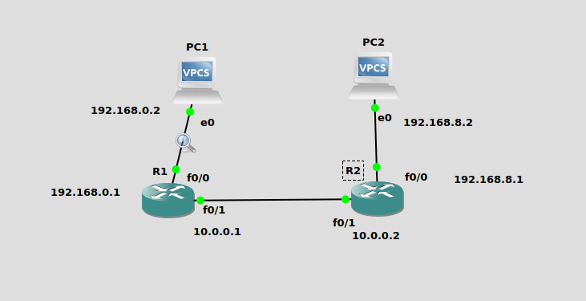
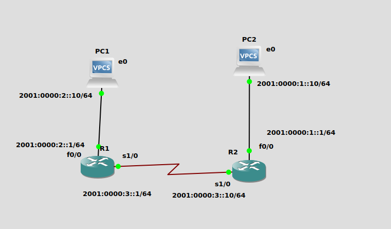

## Network Topology Explanation

### Part 1: 192.168.0.0/16 Network

#### Subnet Creation:
- **Subnet A**: `192.168.0.0/21`
  - Prefix: `192.168.0.0`
  - Identifier: `A`
- **Subnet B**: `192.168.8.0/21`
  - Prefix: `192.168.8.0`
  - Identifier: `B`

#### Subnet Details:
- **Subnet A**:
  - Subnet Mask: `255.255.248.0`
  - Broadcast: `192.168.7.255`
  - First IP: `192.168.0.1`
  - Last IP: `192.168.7.254`
  
- **Subnet B**:
  - Subnet Mask: `255.255.248.0`
  - Broadcast: `192.168.15.255`
  - First IP: `192.168.8.1`
  - Last IP: `192.168.15.254`

#### Subnet Table:

| Subnet Name | Subnet A    | Subnet B    |
|-------------|-------------|-------------|
| Subnet ID   | 192.168.0.0 | 192.168.8.0 |
| Mask        | 255.255.248.0 | 255.255.248.0 |
| First IP    | 192.168.0.1 | 192.168.8.1 |
| Last IP     | 192.168.7.254 | 192.168.15.254 |
| Broadcast IP| 192.168.7.255 | 192.168.15.255 |

#### Configuration:
(a) **PC1 and PC2 Configuration:**
- PC1: IP `192.168.0.2`, Subnet Mask `255.255.248.0`, Gateway `192.168.0.1`
- PC2: IP `192.168.8.2`, Subnet Mask `255.255.248.0`, Gateway `192.168.8.1`

(b) **Router 1 and 2 Interfaces Configuration:**
- **R1:**
  - Interface f0/0: IP `192.168.0.1`, Subnet Mask `255.255.248.0`
  - Interface f0/1: IP `10.0.0.1` (Assuming another network)
- **R2:**
  - Interface 0/0: IP `192.168.8.1`, Subnet Mask `255.255.248.0`
  - Interface 0/1: IP `10.0.0.2` (Assuming another network)

(c) **Route Definition:**
- For Subnet B in PC1: Route `192.168.0.2/21` via `192.168.0.1`
- For Subnet A in PC2: Route `192.168.8.2/21` via `192.168.8.1`

### Part 2: 2001:db8:::/64 Network

Select two prefixes within the 2000::/3 routable address range, for example:
- Prefix for A: `2001:db8:a::2/64`
- Prefix for B: `2001:db8:b::2/64`

#### IPv6 Addresses Configuration on Router 1 and Router 2:

- **Router 1 Interface connected to A:**
  ```
  R1(config)# interface f0/0
  R1(config-if)# ipv6 address 2001:db8:a::1/64
  R1(config)# interface s1/0
  R1(config-if)# ipv6 address 2001:db8:10::1/64
  ```
- **Router 2 Interface connected to B:**
  ```
  R2(config)# interface f0/0
  R2(config-if)# ipv6 address 2001:db8:b::1/64
  R2(config)# interface s1/0
  R2(config-if)# ipv6 address 2001:db8:10::2/64
  ```

#### Router Advertisement Activation:
- On **Router 1 Interface connected to A**:
  ```
  R1(config-if)# ipv6 nd other-config-flag
  R1(config)#ipv6 route 2001:db8:b::/64 2001:db8:10::2
  R1(config)#ipv6 unicast-routing
  ```
- On **Router 2 Interface connected to B**:
  ```
  R2(config-if)# ipv6 nd other-config-flag
  R2(config)#ipv6 route 2001:db8:a::/64 2001:db8:10::1
  R2(config)#ipv6 unicast-routing
  ```

#### Additional Configurations:
- **Ping Test**: `ping 2001:db8:b::10`
- **Router 1 and Router 2 Routes Configuration:**
  - Adjust interfaces and addresses accordingly, including IPv6 6to4 addresses for Router 2's IPv4 address.
