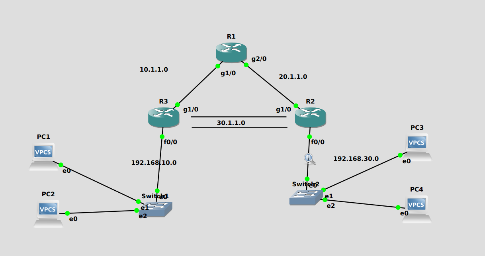

# Network Configuration with Tunnel Implementation

This document outlines the setup and configuration of a network within GNS3, featuring a tunnel between two segments to enable secure communication. The network comprises four PCs, two routers (R1 and R2), and a tunnel configuration between R2 and R3, facilitating connectivity across different network segments.

## Network Devices and Configuration



### PCs

- **PC1**
  - IP/MASK: `192.168.10.2/24`
  - Gateway: `192.168.10.1`
- **PC2**
  - IP/MASK: `192.168.10.3/24`
  - Gateway: `192.168.10.1`
- **PC3**
  - IP/MASK: `192.168.30.2/24`
  - Gateway: `192.168.30.1`
- **PC4**
  - IP/MASK: `192.168.30.3/24`
  - Gateway: `192.168.30.1`

- **Configuration:**
    ip 192.168.\*.\*/24 192.168.\*0.1 - {$IP, $Gateway}

### Routers

- **R1 Configuration Highlights:**
  - GigabitEthernet1/0: `10.1.1.2`
  - Tunnel10: `30.1.1.1`
  - FastEthernet0/0: `192.168.10.1`.

- **R2 Configuration Highlights:**
  - FastEthernet0/0: `192.168.30.1`
  - GigabitEthernet1/0: `20.1.1.2`
  - Tunnel10: `30.1.1.2`

- **R3 Configuration Highlights:**
  - GigabitEthernet1/0: `20.1.1.1`
  - GigabitEthernet2/0: `10.1.1.1`

- **Configuration Routers:**
    - config t
    - int g1/0
    - ip address 10.1.1.2 255.255.255.0
    - no shutdown
    - exit
    - ip route 192.168.30.0 255.255.255.0 20.1.1.2


## Tunnel Configuration (Ex: R3)

To configure a tunnel on Router 3 (R3), follow these steps:

```bash
    interface tunnel 10
    ip address 30.1.1.1 255.255.255.0
    tunnel source gigabitEthernet1/0
    tunnel destination 20.1.1.2
    tunnel mode gre ip
    exit

    access-list 117 permit gre host 10.1.1.2 host 20.1.1.2

    router eigrp 1
    no auto-summary
    network 30.1.1.0
    network 192.168.10.0
    exit
```

This configuration establishes a GRE tunnel, setting up a virtual point-to-point link between R3 and another router. The `tunnel source` and `tunnel destination` commands define the endpoints of the tunnel, while the access list permits GRE (Generic Routing Encapsulation) traffic between these endpoints. The EIGRP routing configuration ensures that routes through the tunnel are advertised, facilitating connectivity across the network segments.

## Conclusion

The network setup and configuration outlined, including the implementation of a tunnel between routers R2 and R3, exemplifies a comprehensive strategy for simulating intricate network scenarios using GNS3. The tunnel not only enhances the network's security by encapsulating data packets for transmission over the public or shared infrastructure but also boosts the network's efficiency and connectivity between disparate segments. Through this practical approach, the configuration demonstrates a resilient and flexible network architecture, capable of supporting secure and seamless communication across different network areas.